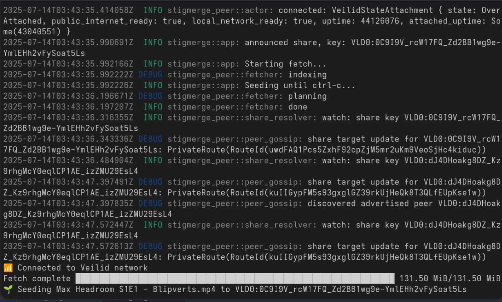
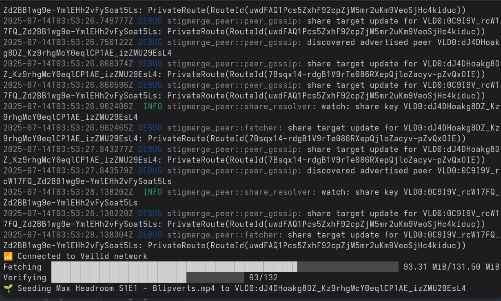

# stigmerge

[](https://crates.io/crates/stigmerge)
[](https://docs.rs/stigmerge-fileindex)
[](https://docs.rs/stigmerge-peer)
[](./LICENSE)

stigmerge sends and receives file content anonymously over the [Veilid](https://veilid.com) network.

# Quick start

## Seeding a file

Similar to bittorrent, stigmerge users cannot fetch a file unless it's currently being seeded by a peer.

`stigmerge seed <file>` indexes and seeds a file, displaying the dht key which can be used to fetch it. For example (demo file obtained from the Internet Archive):

```
stigmerge seed ~/Videos/Max\ Headroom\ S1E1\ -\ Blipverts.mp4
```



## Fetching a file

`stigmerge fetch <dht key>` fetches a file from peers seeding it, storing it
in the current working directory by default. Note the DHT key
`VLD0:0C9I9V_rcW17FQ_Zd2BB1wg9e-YmlEHh2vFySoat5Ls` displayed above; the seeder
provides this key to others in order for them to fetch it.

```
stigmerge fetch VLD0:0C9I9V_rcW17FQ_Zd2BB1wg9e-YmlEHh2vFySoat5Ls
```



Note that this peer is also seeding the share to its own DHT key,
`VLD0:dJ4DHoakg8DZ_Kz9rhgMcY0eqlCP1AE_izZMU29EsL4`, even while it is still
fetching the content from other peers. There are no leechers in a stigmerge swarm; all peers are
seeders. Peers also support the underlying Veilid network as [Veilid nodes](https://veilid.com/how-it-works/).

## Gossip

stigmerge peers "gossip" with each other, announcing themselves to the peers
they fetch from, and exchanging other peers they have discovered in the swarm
with each other. These relationships are posted to the Veilid DHT, so that even
when a peer drops offline, its last-known neighbors can still be followed from
the share DHT to join the swarm.

A peer might start by fetching blocks of a payload from the initially provided
peer, but eventually it will attempt other peers, and gravitate toward the most
productive peers.

# Usage

See `stigmerge --help` for more options.

TODO: explain some of the highlights here:
- state dir
- output dir
- index digest auth

## Try it!

Try fetching a test file with `stigmerge fetch VLD0:Q0TGVjxV-LjDtpsj1wojsEBx8SU9egVwSlKo0bNjQoY`.

This is seeding from a secret location.

# Install

Install a [binary release](https://github.com/cmars/stigmerge/releases) on Linux, macOS or Windows.

## Podman & Docker

Substitute `docker` for `podman` if necessary.

Build the container with `podman build -t stigmerge .` or pull [stigmerge/stigmerge](https://hub.docker.com/r/stigmerge/stigmerge):latest.

Mount `/data` to seed files from or fetch files to the host. The current working directory defaults to this volume in the container.

Mount `/state` to access details about the peer, such as the share key for distribution.

The following example seeds a file `linux.iso` located at `./data/linux.iso`.

```bash
podman run --rm \
    -v `pwd`/data:/data:rw,Z \
    -v `pwd`/state:/state:rw,Z \
    stigmerge seed linux.iso
```

The share key for this peer is written to `/state/share_key`. 

```
$ cat state/share_key
VLD0:RDwOzUCVwY2EhL4z1C_od1J2JMS8oZbPgIuI6k5sS0I
```

Another peer could then fetch this file to ~/Downloads/linux.iso with

```bash
podman run --rm \
    -v ~/Downloads:/data:rw,Z \
    -v `pwd`/state:/state:rw,Z \
    stigmerge fetch VLD0:RDwOzUCVwY2EhL4z1C_od1J2JMS8oZbPgIuI6k5sS0I
```

## Rust crate

Build and install from crates.io with `cargo install --locked stigmerge`.

Crate dependencies may require system packages to be installed depending on the target platform.

Debian Bookworm needs `apt-get install build-essential libssl-dev pkg-config`.

Others may be similar.

## Nix flake

Run stigmerge on Nix with `nix run github:cmars/stigmerge`.

Add this flake (`github:cmars/stigmerge`) as an input to your home manager flake.

Or add the default package to a legacy `home.nix` with something like:

    (builtins.getFlake "github:cmars/stigmerge").packages.x86_64-linux.default

## Android (termux binary)

Stigmerge can be compiled from source and run on the command-line with [Termux](https://termux.dev) on Android.

Rust compilation can be memory intensive, and may OOM on memory-constrained devices.

You'll need to install Rust and Cargo to build it, and the following runtime dependencies:

```bash
pkg install which
pkg install openjdk-21
```

Other JDKs might work as well, YMMV. Comments in
[stigmerge/src/bin/stigmerge.rs](./stigmerge/src/bin/stigmerge.rs) explain why
this is currently necessary.

# Plans

What's on the roadmap for a 1.0 release.

## Native UI App

Currently evaluating Tauri for a cross-platform desktop / mobile app. I've considered Flutter but Rust and JS are more familiar than Dart.

## Magnet links

Stigmerge magnet links would encode payload and index digests, and a set of bootstrap peers to locate & discover the active swarm.

## Multi-file shares

The stigmerge wire protocol and indexing structures support multi-file shares, but this hasn't been fully implemented yet.

## Larger share sizes

Veilid's DHT places an upper limit on how large an index can be, currently around 32GB payload size (see #256).

One easy solution to this: allow larger sized pieces for larger shares. This comes with tradeoffs. Larger pieces are less error tolerant; a failed piece requires a larger re-fetch.

Another alternative is to keep the piece size fixed at 1MB, and chain DHTs to store large indexes.

## Improving the network

There's a lot of opportunity to hint to peers which blocks are available.

There may be a need to shed load and throttle traffic.

# Troubleshooting

## Clock skew

stigmerge operates an embedded Veilid node, which requires a synchronized local clock. Clock skew can prevent stigmerge from connecting to the Veilid network.

## Debug logging

Logging can be configured with the [RUST_LOG environment variable](https://docs.rs/env_logger/latest/env_logger/#enabling-logging).

Log levels can be set on a per-crate basis to focus on a specific problem area without getting flooded with debug or trace-level noise from other parts of the application.

Default logging for the `stigmerge` CLI is equivalent to `RUST_LOG=stigmerge=debug,stigmerge_peer=debug`.

## Issues

When opening an issue, note the OS type, OS release version, stigmerge version, and steps to reproduce. Any logs you can attach may help.

# Development

In a Nix environment, `nix develop github:cmars/stigmerge` (or `nix develop` in this directory) to get a devshell with the necessary tool dependencies.

On other platforms a [Veilid development environment](https://gitlab.com/veilid/veilid/-/blob/2ec00e18da999dd16b8c84444bb1e60f9503e752/DEVELOPMENT.md) will suffice.

`capnp` is only necessary when working on the protocol wire-format.

## CICD

Github is used for CICD and especially [release automation](https://blog.orhun.dev/automated-rust-releases/).

## Contributions

Branches and releases are regularly mirrored to [Codeberg](https://codeberg.org/cmars/stigmerge). Pull requests might be accepted from either, if they fit with the project plans and goals.

Open an issue and ask before picking up a branch and proposing, for best results.
